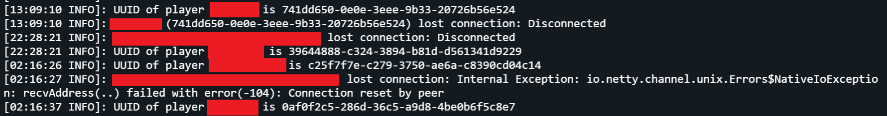

# IP Blocker
A Paper plugin that allows users to block IPs before they appear in console.\
This is mainly to block the annoying "server seekers" that keep spamming your console.\
Blocked IPs can't ping the server in the server list or join the server.

__This plugin was made and tested in Paper 1.21.10!__

# Installation
- [Download](https://github.com/erenkarakal/IPBlocker/releases/latest) the plugin.
- Place it in your `plugins` folder.
- Restart the server.

# Commands
| Command                      | Description       |
|------------------------------|-------------------|
| ` /ipblocker block  <ip> `   | Blocks an IP      |
| ` /ipblocker unblock  <ip> ` | Unblocks an IP    |
| `/ipblocker list <page = 1>` | Lists blocked IPs |
All command require the `ipblocker.admin` permission.
